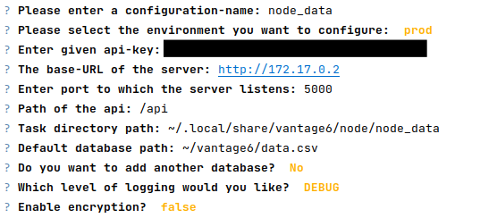

# Vantage6 infrastructure

Setting up a local vantage6 infrastructure.

## Requirements

- Python 3.7 or higher
- Pip
- Virtualenv

## How to setup infrastructure

First you should build a virtual environment and install the required 
dependencies. We recommend you to use `pyenv` for python version management.
Assuming that you have `pyenv` and a local version of python 3.7 installed,
you can run the following to automatically create the environment:

``` bash
./create_virtualenv.sh
```

Once the virtual environment is created, you can activate it by running the
following:

``` bash
source .venv/bin/activate
```

The next step is to create the master node, which you can do by running the 
following command:

``` bash
vserver new --user
```

You will be asked for certain input, which you can fill in with roughly the
following:

 

You can then start the master node by running:

``` bash
vserver start --user --attach
```

and selecting the server you just created. The `--attach` option can be used
to see the logs of the server.

Now run the `manage.py` script, which will create collaborations, organizations,
users, etc. Just edit this script based on your needs. It might be a good idea
to submit the post requests in parts and check that you use the proper ids, 
instead of blindly running the whole script.

``` bash
python manage.py
```

You will see in the logs of the server the actions happening.

Now you should create the node(s) you added. You will need to know a few input
parameters. An api key was created when you added the node in the server. Make 
a GET request to see which api key was assigned. You can run the following
script for that:

``` bash
python get_key.py
```

If running locally on MacOS or Windows use `http://host.docker.internal` as the
server url and for Linux check the IP address of the Network bridge:

``` bash
docker inspect <server_container_id>
```

and use it as the server url. You can finally create the node(s) you added:

``` bash
vnode new
```

Below an example of the inputs you can give:



You can then start the node(s) by running the following:

``` bash
vnode start --attach
```

and selecting the data node(s) you just created. You need to create and start 
each node separately.

Finally, you can check whether your local infrastructure is working by running
the example task in `run_task.py`:

``` bash
python run_task.py
```

You can see that we are using a user that was created by `manage.py` to
authenticate and submit the task. That would in practice be a researcher,
for instance. If you look to the logs being printed for the master server
and data nodes, you will see all the actions happening. Meaning the task
request being submitted to the master, transmitted to the data nodes, and 
results being reported back to the master and then to the researcher.

If you want to stop master and data nodes, do the following:

``` bash
vserver stop --user
vnode stop
```

and select the desired server and data nodes to stop.

## Useful links

- [Vantage6 documentation](https://docs.vantage6.ai/)

- [API documentation](https://api-test.distributedlearning.ai/apidocs/)

